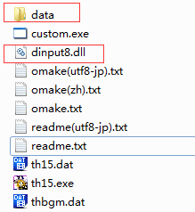

# 从0x00000000开始的魔改教程

## 目录

[TOC]

## 第〇章 认识 thtk 以及 thtk-gui

### 1.简介

&emsp;&emsp;“工欲善其事，必先利其器”。thtk套件是解开东方正作游戏脚本文件的工具，thtk-gui 则是在 Windows 下，thtk 的可视化工具。（资源见附件）

### 2.使用方法

&emsp;&emsp;在 thtk-gui 的 thtk 目录下可以找到 thtk 所包含的文件，其中的可执行文件包括 thanm.exe, thdat.exe, thecl.exe, thmsg.exe, thstd.exe，分别用于解包或打包 *.anm（贴图及贴图动画文件）, *.dat（游戏所有资源文件）, *.ecl（关卡脚本文件）, *.msg（对话脚本文件）, *.std（3D背景脚本文件）文件。该套件为命令行程序，在终端空参数调用即可获得说明内容，这里不再细讲，主要讲解 thtk-gui 的用法。

&emsp;&emsp;现在所使用的 thtk-gui 是由<font color=blue>@鶸</font>制作的支持新版 thtk 的 Windows 窗口程序，可以直接双击运行，运行截图如下:

<center> </center>

<center>thtk-gui 界面（图0-2-1）</center>

&emsp;&emsp;有两个比较重要的选项：单击菜单栏中的“游戏”，可以选择需要处理的游戏。单击设置，可以选择使用的 thtk 版本，thtk 推荐使用目前的最新版本——thtk12（写作于2020/3/15）。

&emsp;&emsp;解包 *.dat, *.ecl, *.msg, *.std 的一般方法如下：在对应一栏的文件路径中填入或使用输入栏右侧按钮选择所需解包的文件路径（如：在 thdat 一栏的文件路径中填入"E:/东方/东方绀珠传/th15.dat"），在解包路径中填入或选择解包所得到的文件存储路径（如：在 thdat 一栏的文件路径中填入"E:/东方/东方绀珠传/data"），点击解包，等待程序运行结束，便可以在解包路径下找到所得文件。

&emsp;&emsp;解包 \*.anm 的一般方法与上述步骤有所不同，还需点击获取描述文件以获取 \*.ddes（贴图裁切及动画文件）文件。

### 第〇章练习

> <font color=red>学习魔改的最好方法就是不断的尝试，请不要因为某些东西显而易见而直接跳过必要的试验。</font>

1. 尝试使用thtk-gui解包 \*.dat, \*.ecl, \*.msg, \*.anm, \*.std 文件。
1. 尝试使用thtk-gui打包 \*.dat, \*.ecl, \*.msg, \*.anm, \*.std 文件。
1. <font color=green>尝试使用命令行打包、解包 \*.dat, \*.ecl, \*.msg, \*.anm, \*.std 文件。</font>（绿色字体的练习题为选做题）

## 第〇丶五章 脚本负责的东西有什么

&emsp;&emsp;新人常常纠结于到底哪些东西能改。其实，只要你想做就没有做不出来的，唯一的限制因素就是你的技术力。本教程主要解释游戏脚本的编写，所以这里需要解说一下游戏脚本文件负责了哪些游戏内容。
&emsp;&emsp;解包 *.dat，按类型分组，可以看到如下文件类型：

- *.anm：包含贴图、贴图动画、事件，可以进行简单的运算
- *.ecl：控制游戏关卡流程（可以调用贴图、对话、3D背景，创建敌人、弹幕、道具，进行计算、运行算法）
- *.fmt：BGM循环点信息
- *.msg：控制游戏对话、ed、BGM 切换等，不能进行运算
- *.sht：自机火力信息（简单射击，像地灵殿中那些机体无法只通过该脚本制作，也无法制作 Bomb）
- *.std：控制3D背景（贴图分布、cam 事件等），不能进行运算
- *.ver：版本号效验文件
- *.wav：游戏音效
- *.png：帮助界面贴图
- *.txt：musicroom 文字（musiccmt.txt）以及成就文字（trophy.txt）

&emsp;&emsp;综合上述内容，我们可以看出，修改游戏 *.dat 中的文件，可以做出东方emoji船等改图作品，可以做出 bossrush 等简单修改作品，可以做出 th15randomAttack 等改弹幕作品，也可以做出天空璋PH这样的融多种脚本为一体的作品。但是不能做出像相对传、炫迈传那样的作品。


## 第一章 从认识ECL到魔改ECL再到编写ECL

### 1.ECL简介

&emsp;&emsp;*.ECL 是用于控制关卡内弹幕、敌人的生成并兼有控制贴图、背景、对话的脚本，是功能最强大的脚本，也是游戏主要内容的体现。

&emsp;&emsp;*.ECL 可以被 thecl 解包为便于阅读的格式。在此，所有的讲解内容均参照 <font color=red>thtk12 第四世代</font>标准，这是一种类C语言格式，语法和C语言基本一致。

&emsp;&emsp;其中的**指令（instruction）**功能可以在[ECL脚本对照表](https://thwiki.cc/脚本对照表/ECL/)查询。

### 2.语法

#### 导语

&emsp;&emsp;语法是认识ECL的基础，掌握好语法才能保证在将来编写ECL的时候不会出现语法上的纰漏。当然，这章也可以先跳过，等真正遇到了语法问题时再回过头来阅读。（有C语言语法基础的同学们就可以非常愉快地跳读了）

#### (1) 代码结构以及脚本运行

##### 引例 ECL震屏实例

&emsp;&emsp;ECL脚本通常包含以下几个部分

- 引用指令
- **预处理指令（directive）**
- **子程序（Subroutines）**
- **变量（variable）**
- **指令（instruction）**
- **表达式（expression）**

```c
anim {"enemy.anm";}
ecli {"foo.ecl";}
/*以上是引用指令*/
#include "wsm.decl"
//下面是main
void main(){
    ins_502(32);
    ins_517(60,5,5);
    ins_23(100000);
    return;
}
```

&emsp;&emsp;接下来我们讲解一下上面这段代码：

1. 第一、二两行是引用指令，告诉这一段代码运行时需要包含 enemy.anm 和 foo.ecl 文件。

2. 第三行是注释，注释用 /**/ 包围。注释在打包时将被忽略。

3. 第四行是预处理指令，告诉thecl在打包的时候需要包含 wsm.decl 文件。

4. 第五行为单行注释的写法，单行注释以//开始，换行结束。

5. 第六行开始为main()子程序，7~9行中 ins_*() 是可用的指令。

6. return;将终止 main() 子程序。

&emsp;&emsp;将上述代码填写到附件第一章震屏实例的 myECL.decl 文件中，可以使用你喜欢的文本编辑器打开 *.decl 文件，在这里我推荐 notepad++ 这款文本编辑器，并使用 cpp 语法高亮。我们再继续进行下一步。

##### 打包&执行ECL脚本

&emsp;&emsp;打包方法已在〇-2章节中指出，将 myECL.decl 和 foo.decl 打包。此处 #include "wsm.decl"，因此 myECL.decl 应该和 wsm.decl 放在同一个目录下。原因将在后面的章节解释。

&emsp;&emsp;这里重点讲解如何快速的执行ECL脚本，现在国内主流方法是使用 THResHack 工具。该工具包含一个 dinput8.dll 文件，将该文件放到游戏根目录（这里使用东方绀珠传），新建名为 data 的文件夹，将打包好的 myECL.ecl 和 foo.ecl 放入其中（使用了 ecli {"foo.ecl";}，原理后面解释），或者直接在该文件夹中完成打包操作。然后把 myECL.ecl 的文件名改成游戏中已有的ECL文件名（这里使用 st01.ecl），以替换对应内容。

&emsp;&emsp;操作如下图所示：

<center></center>

<center><div>游戏根目录（图1-2-1）</div></center>

<center></center>

<center><div>data 文件夹中（图1-2-2）</div></center>

&emsp;&emsp;此后，进入游戏，打开一面，就可以看到震屏效果。

#### (2) 标记（token）

##### 简介

&emsp;&emsp;与C程序相同，ECL脚本由各种**标记（token）**组成，标记可以是关键字、标识符、常量、字符串值，或者是一个符号。例如，下面的代码包括五个标记：

```c
	ins_23(100000);
```

&emsp;&emsp;分别是

```c
	ins_23
    (
    100000
    )
    ;
```

##### 分号 ;

&emsp;&emsp;在ECL脚本中，分号是语句结束符。也就是说，每个语句必须以分号结束。它表明一个逻辑实体的结束。例如，下面是两个不同的语句：

```c
	ins_23(60);
	return;
```

##### 注释

&emsp;&emsp;ECL脚本中有两种注释方式：

```c
//单行注释
```

&emsp;&emsp;以`//`开始的单行注释，这种注释可以单独占一行。

```c
/* 单行注释 */
/* 
 多行注释
 多行注释
 多行注释
 */
```

&emsp;&emsp;`/* */`这种格式的注释可以单行或多行。

&emsp;&emsp;您不能在注释内嵌套注释，注释也不能出现在字符串或字符值中。

##### 标识符

&emsp;&emsp;ECL脚本中的标识符是用来标识变量、子程序，或任何其他用户自定义项目的名称。一个标识符以字母 A-Z 或 a-z 或下划线 _ 开始，后跟零个或多个字母、下划线和数字（0-9）。

&emsp;&emsp;ECL脚本中的标识符不允许出现标点字符，比如 @、$、%等。ECl脚本是**严格区分大小写**的语言。因此，在ECL脚本中，ENDKING 和 endking 是两个不同的标识符。下面列出几个有效的标识符：

```c
mohd       zara    abc   move_name  a_123
myname50   _temp   j     a23b9      retVal
```

##### 关键字

&emsp;&emsp;下面列出了ECL脚本中的保留字。这些保留字不能作为标识符名称。

&emsp;&emsp;`anim`, `ecli`, `sub`, `timeline`, `var`, `int`, `float`, `void`, `inline`, `return`, `goto`, `unless`, `if`, `else`, `do`, `while`, `times`, `switch`, `case`, `default`, `break`, `async`, `global`, `sin`, `cos`, `sqrt`

##### 空格

&emsp;&emsp;只包含空格或注释的行，被称为空白行，thecl 会完全忽略它。

&emsp;&emsp;在ECl脚本中，空格用来描述空白符、制表符、换行符和注释。空格分隔语句的各个部分，让 thecl 能识别语句中的某个元素（比如 void）在哪里结束，下一个元素在哪里开始。因此，在下面的语句中：

```c
void main(){}
```

&emsp;&emsp;在这里，void 和 main 之间必须至少有一个空格字符，这样 thecl 才能区分它们。另一方面，在下面的语句中：

```c
ins_517(60, 7, 7);
```

&emsp;&emsp;, 和 7 之间的空格字符不是必需的，可以根据个人喜好增减。

&emsp;&emsp;另外，由于 bug，某些地方的空格字符是必需的，bug 大概将于下个 thtk 版本修复。

##### 一-2-(2)练习题

1. 判断下列哪些是有效标识符：

    ```
    AbCdEfG, _1_1_4_, 10enm, a5sf6bx7w, ip%ppp
    ```

#### (3) 数据类型以及字面量

&emsp;&emsp;ECL脚本中只有四种**数据类型**，分别是整数类型、**浮点数**类型、void类型与字符串类型。**字面量**是代码中固定值的表示方法，顾名思义，字面量的含义也就是它的字面意思。

##### 整数类型

&emsp;&emsp;整数类型的说明符为 `int`，其值范围为 -2147483648~2147483647

&emsp;&emsp;以下展示几种整数字面量的写法：

&emsp;&emsp;`9961`：这是一个十进制整数。

&emsp;&emsp;`0x26E9`：用`0x`表示这是一个十六进制整数。

&emsp;&emsp;`0b10011011101001`：用`0b`表示这是一个二进制整数

##### 浮点数类型

&emsp;&emsp;浮点数是精度有限的小数，其说明符为 `float`。

&emsp;&emsp;以下展示几种浮点数字面量的写法：

&emsp;&emsp;`2.5f`：这是一个浮点数，其值为 2.5。

&emsp;&emsp;`2f`：这是一个浮点数，其完整写法为`2.0f`，其值为 2.0。

&emsp;&emsp;`2.0`：这是一个浮点数，其完整写法为`2.0f`，其值为 2.0。

&emsp;&emsp;`2.f`：这是一个浮点数，其完整写法为`2.0f`，其值为 2.0.

##### void类型

&emsp;&emsp;void说明符表明没有可用的值，仅用于子程序的**返回值**，如：

```c
void main(){/*...*/}
void foo(){/*...*/}
```

##### 字符串类型

&emsp;&emsp;字符串的说明符为 `string`。

&emsp;&emsp;字符串字面量用双引号 `" "`包围，其中可包含转义符号 `\`，以下展示几种字符串字面量的写法：

&emsp;&emsp;`"Hello World!"`

&emsp;&emsp;`"C:\\Windows\\setu"`

&emsp;&emsp;其中第二个示例中使用了**转义字符**，ECL中定义了一些字母或数字前加 `\` 来表示常见的那些不能显示或在代码内有特殊意义的字符。常用的有转义字符有 `\加数字` 表示 [ASCII 码]([https://baike.baidu.com/item/ASCII/309296?fromtitle=ascii%E7%A0%81&fromid=99077](https://baike.baidu.com/item/ASCII/309296?fromtitle=ascii码&fromid=99077)) 所对应的字符， `\\` 表示 `\`，`\n` 表示换行符，其它请参见 [转义字符]([https://baike.baidu.com/item/ASCII/309296?fromtitle=ascii%E7%A0%81&fromid=99077](https://baike.baidu.com/item/ASCII/309296?fromtitle=ascii码&fromid=99077))。

##### 一-(3)练习题

1. 在文本编辑器中键入几个有效的字面量。
2. <font color=green>阅读ASCII码与转义字符的相关百科或博客。</font>

#### (4) 变量

&emsp;&emsp;**变量（variable）**是可操作的存储区的名称，是程序中可以被修改的量。ECL脚本中的每个变量都有特定的类型，类型决定了变量存储的大小和布局。运算符可以运用于变量上。

&emsp;&emsp;变量命名要符合标识符规范。变量的类型仅有 `int` 和 `float` 两种类型。

##### 变量的声明定义

&emsp;&emsp;变量在定义时应指定一个数据类型，并包含了该数据类型的一个或多个变量的列表，如下所示：

```c
type variable_list
```

&emsp;&emsp;在这里，`type` 是一个 `int` `float` 中的任意一个，`variable_list` 可以由一个或多个标识符名称组成，多个标识符之间用逗号分隔。以下是几个有效的声明定义：

```c
int i,j,k,xSWl,_xmsl;
float n,m,s,l;
```

&emsp;&emsp;变量可以在声明定义时被初始化（指定一个初始值）。初始化由一个等号，后跟一个常量表达式组成，如下所示：

```c
type variable_name=value
```

&emsp;&emsp;下面列举几个实例：

```c
int Cirno=9,Rumia=10;
float Satori=5.0,Utsuho=6.0;
```

&emsp;&emsp;<font color=green>特殊的，变量的类型可以用 `var` 关键字代替，具体使用方法在后面指出（不推荐使用）</font>

##### 变量的赋值与使用

&emsp;&emsp;变量在声明定义后，可以在程序内被重新赋值，也可以被指令使用，实例如下：

```c
void main(){
    int a=20;
    ins_23(a);
    a=30;
}
```

&emsp;&emsp;我们可以看到，`a` 在声明定义时被初始化为 20，然后被 `ins_23` 作为参数使用，然后被赋值改变为 30，在这里，第二个等号的意义是**赋值** 。

&emsp;&emsp;若使用 `var` 声明定义变量，则需要在使用变量的地方加上强制类型声明，实例如下：

```c
void main(){
    var a,b;
    %a=3.0f;
    $b=5;
    ins_23($b);
    ins_23(%a);
}
```

&emsp;&emsp;我们可以看到，变量在赋值和使用时，浮点型变量前面加上了符号 `%` ，整型变量前面加上了符号 `$`。

##### 左值（Lvalues）与右值（Rvalues）

&emsp;&emsp;**左值**：指向内存位置的表达式被称为左值表达式。左值可以被赋值，左值表达式可以出现在赋值号 `=` 的左边或右边。

&emsp;&emsp;**右值**：存储在内存中某些地址的数值称为右值。右值不能被赋值，右值表达式只能出现在赋值号 `=` 的右边。

&emsp;&emsp;变量是左值，字面量是右值。

##### 一-2-(4)练习题

1. 将震屏实例中的字面量改为变量并尝试打包运行。
2. 尝试给右值赋值，查看打包器的报错信息。

#### (5) 局部变量、本地变量、全局变量以及作用域

##### 作用域

&emsp;&emsp;**作用域**是程序中定义的变量所存在的区域，超过该区域变量就不能被访问。

##### 局部变量

&emsp;&emsp;上一节介绍的所有变量都被称为**局部变量**，局部变量的作用域为其被声明定义的**语句块**（在程序控制结构部分讲解）。

##### 本地变量

&emsp;&emsp;**本地变量**的作用域是特定的**单位（object）**，本地变量不可以声明，只能使用游戏所预置的。其暂且分为两种，一种是可读写的本地变量，一种是只读的本地变量。下列是可读写的局部变量：

1. 已确定作用域为单位及该单位生成的单位：整型 `[-9985]~[-9982]`，浮点型 `[-9981.0f]~[-9978.0f]`。

2. 未确定作用域是否可传递到该单位生成的单位：整型 `[-9943]~[-9940]`，浮点型 `[-9939.0f]~[-9932.0f]`。

&emsp;&emsp;单位的定义将在后面的章节给出，先了解有这么一个东西。

##### 全局变量

&emsp;&emsp;**全局变量**的作用域是ECl脚本中的任何位置。全局变量不可以声明，只能使用游戏所预置的。全局变量有两种，一种是可读写的全局变量，一种是只读的全局变量。可读写的全局变量如下：

&emsp;&emsp;整型 `[-9926]~[-9923]`，浮点型 `[-9922.0f]~[-9915.0f]`。

&emsp;&emsp;所有的本地变量和全局变量可以在 [priw8的变量表（英文注意）](https://priw8.github.io/#s=modding/vars)或[MUA组的变量表（不够详细注意）](https://thwiki.cc/脚本对照表/ECL)查询。

##### 一-2-(5)练习题

1. 阅读变量表，并将震屏实例中的常量改为局部变量和全局变量，尝试打包运行。
2. 尝试将震屏实例中的震屏强度改为一个合理的只读变量，尝试打包运行。

#### (6) 运算符

&emsp;&emsp;**运算符**是告诉程序执行特定的数学或逻辑操作的符号。与C语言相同，ECL脚本内置了丰富的运算符，并提供了以下类型的运算符：

- 算术运算符
- 关系运算符
- 逻辑运算符
- 位运算符
- 赋值运算符
- 杂项运算符

&emsp;&emsp;本节将逐一介绍算术运算符、关系运算符、逻辑运算符、位运算符、赋值运算符和杂项运算符。

##### 算术运算符

&emsp;&emsp;下表展示了ECL脚本支持的所有算数运算符。下表中 `A=10`，`B=20`，其中 `var` 表示 `int` 或 `float` 类型皆可。

| 运算符 | 操作数   | 描述                                                         | 实例               |
| ------ | -------- | ------------------------------------------------------------ | ------------------ |
| +      | var, var | 把两个操作数相加                                             | `A + B` 得到 `30`  |
| +      | var      | 置于操作数之前表示正数                                       | `+A` 得到 `10`     |
| -      | var, var | 从第一个操作数中减去第二个操作数                             | `A - B` 得到 `-10` |
| -      | var      | 置于操作数之前表示负数                                       | `-A` 得到 `-10`    |
| *      | var, var | 把两个操作数相乘                                             | `A * B` 得到 `200` |
| /      | var, var | 分子除以分母                                                 | `B / A` 得到 `2`   |
| %      | int, int | 取模运算符，整除后取余数                                     | `A % B` 得到 `10`  |
| --     | int      | 自减运算符，<font color=red>置于变量后</font>，整数值减少1，<font color=red>不能在表达式内使用，且与C中效果不同</font> | `A--` 得到 9       |

&emsp;&emsp;<font color=red>由于 thecl 目前存在 bug，会将形如 `A-B` 和 `A+B` 这样的表达式中的 `-`识别为符号，`+` 识别为正号，因此在书写表达式时务必注意，尽量在数字与运算符间加上适当的空格。</font>

##### 关系运算符

&emsp;&emsp;下表列举了支持的所有关系运算符，其中 `A` 的值为 `10`，`B` 的值为 `20`：

| 运算符 | 描述                                                         | 实例          |
| ------ | ------------------------------------------------------------ | ------------- |
| ==     | 检查两个操作数的值是否相等，如果相等则条件为真。             | `A == B` 为假 |
| !=     | 检查两个操作数的值是否相等，如果不相等则条件为真。           | `A != B` 为真 |
| >      | 检查左操作数的值是否大于右操作数的值，如果是则条件为真。     | `A > B` 为假  |
| <      | 检查左操作数的值是否小于右操作数的值，如果是则条件为真。     | `A < B` 为真  |
| \>=    | 检查左操作数的值是否大于或等于右操作数的值，如果是则条件为真。 | `A >= B` 为假 |
| <=     | 检查左操作数的值是否小于或等于右操作数的值，如果是则条件为真。 | `A <= B` 为真 |

&emsp;&emsp;其中，`真`在代码中写作 `true` ，`假`写作 `false` 。

&emsp;&emsp;`true` 严格等于 `1`，但任何非零的数都可以视为 `true`。`false` 等于 `0`。

##### 逻辑运算符

&emsp;&emsp;下表列举了支持的所有逻辑运算符，其中 `A` 的值为 `true` 即 `1`，`B` 的值为 `false` 即 `0`：

| 运算符 | 描述                                                         | 实例                  |
| ------ | ------------------------------------------------------------ | --------------------- |
| &&     | 逻辑与运算，若两个操作数都为 `true`，值为 `true`，否则为 `false`。 | `A && B` 值为 `false` |
| \|\|   | 逻辑或运算，若两个操作数中至少一个为 `true`，值为 `true`，否则为 `false`。 | `A || B` 值为 `true`  |
| !      | 逻辑非运算，若操作数为 `true` ，值为 `false`，否则为 `true`。 | `!A` 值为 `false`     |

##### 位运算符

&emsp;&emsp;**位运算**相关知识参见[位运算 百度百科](https://baike.baidu.com/item/位运算/6888804?fr=aladdin)。ECL脚本中的 `int` 为32位整数。ECL仅支持 `^`（异或），`|`（或），`&`（与）这三种位运算。

##### 赋值运算符

&emsp;&emsp;赋值运算符是算数运算符、位运算符与赋值符的组合，下表列举了支持的所有赋值运算符，其中 `A` 的值为 `2`。

| 运算符 | 实例                                       |
| ------ | ------------------------------------------ |
| =      | `A = 10` 值为 `10` 并且 `A` 被赋值为 `10`  |
| +=     | `A += 10` 值为 `12` 并且 `A` 被赋值为 `12` |
| -=     | `A -= 10` 值为 `-8` 并且 `A` 被赋值为 `-8` |
| *=     | `A *= 10` 值为 `20` 并且 `A` 被赋值为 `20` |
| /=     | `A /= 2` 值为 `1 ` 并且 `A` 被赋值为 `1`   |
| %=     | `A %= 10` 值为 `2` 并且 `A` 被赋值为 `2`   |
| ^=     | `A ^= 10` 值为 `8` 并且 `A` 被赋值为 `8`   |
| \|=    | `A |= 10` 值为 `10` 并且 `A` 被赋值为 `10` |
| &=     | `A ^= 10` 值为 `2` 并且 `A` 被赋值为 `2`   |

##### 杂项运算符

&emsp;&emsp;ECL脚本中还有几种运算符，如下表所示，其中 `A` 的值为 `90`。

| 运算符                | 描述                                                         | 实例                                                         |
| --------------------- | ------------------------------------------------------------ | ------------------------------------------------------------ |
| condition?expr1:expr1 | 条件表达式，如果 `condition` 为真，值为 `expr1` ，否则为 `expr2` | `A>45?1:2` 值为 `1`                                          |
| :                     | 难度分支，根据游戏难度的不同其值不同                         | `1:2:3:4:5` 在 E、N、H、L、O 难度下值分别为 `1, 2, 3, 4, 5`。`1:2` 在 E 难度下值为 `1`，在 N、H、L、O 难度下值为 `2`。`1:2*2:5` 应等于 `1:4:5`，因为该运算符优先级最低 |
| rad()                 | 将角度转化为弧度，括号中只能是浮点数字面量                   | `rad(90)` 值为 `1.5707964f`                                  |
| sin(float)            | 求操作数的正弦值                                             | `sin(A)` 值为 `1`                                            |
| cos(float)            | 求操作数的余弦值                                             | `cos(A)` 值为 `0`                                            |
| sqrt(float)           | 求操作数的平方根                                             | `sqrt(A)` 值为 `9.486833f`                                   |

##### 一-2-(6)练习题

1. 尝试书写合理的表达式。

2. <font color=green>凭借你所学过的数学知识判断下列表达式的功能（难）。</font>

    ```c
    t1 = (-(2 * x0 * cos(theta) + 2 * y0 * sin(theta) - 2 * a * cos(theta) - 2 * b * sin(theta)) + sqrt((2 * x0 * cos(theta) + 2 * y0 * sin(theta) - 2 * a * cos(theta) - 2 * b * sin(theta)) * (2 * x0 * cos(theta) + 2 * y0 * sin(theta) - 2 * a * cos(theta) - 2 * b * sin(theta)) - 4 * (x0 * x0 + y0 * y0 + a * a + b * b - 2 * a * x0 - 2 * b * y0 - r * r))) / 2;
    t2 = (-(2 * x0 * cos(theta) + 2 * y0 * sin(theta) - 2 * a * cos(theta) - 2 * b * sin(theta)) - sqrt((2 * x0 * cos(theta) + 2 * y0 * sin(theta) - 2 * a * cos(theta) - 2 * b * sin(theta)) * (2 * x0 * cos(theta) + 2 * y0 * sin(theta) - 2 * a * cos(theta) - 2 * b * sin(theta)) - 4 * (x0 * x0 + y0 * y0 + a * a + b * b - 2 * a * x0 - 2 * b * y0 - r * r))) / 2;
    x1 = x0 + t1 * cos(theta); y1 = y0 + t1 * sin(theta);
    x2 = x0 + t2 * cos(theta); y2 = y0 + t2 * sin(theta);
    ```


#### (7) 程序控制结构——分支结构

&emsp;&emsp;由上一节可知，ECL脚本中，所有的非零值均可视为 `true`，零可视为 `false`。大多数编程语言都有如下的分支结构形式：


&emsp;&emsp;根据所学过的知识，三目运算符可以做到这个行为。在ECL脚本中，还有另外的语句可以实现判断结构。

##### if-else 语句

&emsp;&emsp;**if-else** 语句的语法如下：

```c
if (expression){
    //如果表达式值为真则执行
}
else{
    //如果表达式值为假则执行
}
```

&emsp;&emsp;看到以上的代码，不得不提到**语句块（Statement Block）**这一概念。语句块是用大括号 `{ }` 包围起来的若干条语句。程序控制结构通常只“管辖”一个语句或语句块，举个例子：

```c
int a = 2,b = 2
if (a == 1)
    a = 3;
	b = 3;
```

&emsp;&emsp;以上的代码看起来 `a` 和 `b` 最后的值都为 `2`。其实不然，由于 `if` 所管辖范围的原因，`b` 将被赋值为 `3`，而 `a` 保持为 `2`。这是缩进带来的错觉，正确的缩进应改为这样：

```c
int a = 2,b = 2
if (a == 1)
    a = 3;
b = 3;
```

&emsp;&emsp;如果想让`a` 和 `b` 最后的值都为 `2`，应该改成：

```c
int a = 2,b = 2
if (a == 1){
    a = 3;
	b = 3;
}
```

&emsp;&emsp;从以上的代码也可以看出，`else` 部分是可以省略的。同时，`if-else` 结构还可以进行嵌套，比如：

```c
if (Reimu == 2.0){
    if (Marisa == 3.0){
        //魔理沙sb
    }
    else{
        if (Marisa == 2.0){
        	//魔理沙sb
        }
    }
}
else{
    if (Marisa){
        //魔理沙sb
    }
}
```

&emsp;&emsp;当然，当 `else` 后面的块里面没有除 `if` 块以外的东西，可以写成：

```c
if (Reimu == 2.0){
    if (Marisa == 3.0){
        //魔理沙sb
    }
    else if (Marisa == 2.0){
        	//魔理沙sb
        }
}
else if (Marisa){
        //魔理沙sb
}
```

&emsp;&emsp;实质上是将 `else` 后面的语句块替换为了 `if` 语句。

&emsp;&emsp;条件之间也可以通过逻辑运算符连接：

```c
if (Reimu == 2.0 && Marisa == 3.0){//魔理沙sb}
else if (Reimu == 2.0 && Marisa == 2.0){//魔理沙sb}
else if (Reimu != 2.0){//魔理沙sb}
```

&emsp;&emsp;`if-else` 结构所接的语句块中，可以声明定义变量，其作用域为该语句块，比如：

```c
float Reimu = 2.0;
if (Reimu == 2.0){
    float Marisa = 3.0;
}
Marisa = 2.0;
//程序运行到这个位置，Marisa变量已无法访问，第五行的赋值语句会引起错误
```

&emsp;&emsp;以下的代码反映了一个保留特性，<font color=red>在目前版本中无效</font>——**遮蔽变量（shadow variable）**：

```c
float Reimu = 2.0, Marisa = 3.0;
if (Reimu == 2.0){
    float Marisa = 2.0;
    //ECL脚本允许在if块内再次定义与外部相同名称的变量，此时访问变量Marisa，值为2.0
}
//if块执行结束后，遮蔽变量失效，此时变量Marisa的值为3.0
```

<font color=red>&emsp;&emsp;再次说明，以上特性在现有版本的 thecl 中无效，仅供参阅。</font>

##### unless-else 语句

&emsp;&emsp;**unless-else** 语句的使用方法与 `if-else` 语句完全一致，仅含义不同：

```cpp
unless (Reimu==2.0){
    //魔理沙sb
}else{
    //魔理沙还是sb
}
```

&emsp;&emsp;以上代码表示：除非 `Reimu` 为 `2.0`，否则 `魔理沙sb`，否则 `魔理沙还是sb`。

##### switch 语句

&emsp;&emsp;一个 **switch** 语句允许测试一个变量等于多个值时的情况。每个值称为一个 **case**，且被测试的变量会对每个 **switch case** 进行检查。语法如下：

```c
switch(expression){
    case constant-expression  :
       statement(s);
       break; /* 可选的 */
    case constant-expression  :
       statement(s);
       break; /* 可选的 */
  
    /* 您可以有任意数量的 case 语句 */
    default : /* 可选的 */
       statement(s);
}
```

`switch` 语句必须遵循下面的规则：

- `switch` 语句中的 `expression` 是一个常量表达式，必须是一个整型类型。
- 在一个 `switch` 中可以有任意数量的 `case` 语句。每个 `case` 后跟一个要比较的值和一个冒号。
- `case` 的 `constant-expression` 必须与 `switch` 中的变量具有相同的数据类型，且必须是一个常量或字面量。
- 当被测试的变量等于 `case` 中的常量时，`case` 后跟的语句将被执行，直到遇到 `break` 语句为止。
- 当遇到 `break` 语句时，`switch` 终止，控制流将跳转到 `switch` 语句后的下一行。
- 不是每一个 `case` 都需要包含 `break`。如果 `case` 语句不包含 `break`，控制流将会 继续 后续的 `case`，直到遇到 `break` 为止。
- 一个 `switch` 语句可以有一个可选的 `default case`，出现在 `switch` 的结尾。`default case` 可用于在上面所有 `case` 都不为真时执行一个任务。`default case` 中的`break` 语句不是必需的。
- `switch` 语句也可以进行嵌套。

&emsp;&emsp;下面是一个实例：

```c
switch (Reimu){
    case 2.0:
        switch (Marisa){
            case 3.0:
                //不用多说了罢
                break;
            default:
                //不用多说了罢
                break;
        }
    default:
        //不用多说了罢
    	break;
}
```

##### 难度分支结构——!

&emsp;&emsp;ECL脚本中有一种特别的分支结构，即 `:` 表达式的展开形式，`!` 难度分支结构，语法如下：

```c
!E
	a = 1;//Easy
!N
	a = 2;//Normal
!H
	a = 3;//Hard
!L
	a = 4;//Lunatic
!X
	a = 5;//Extra
!O
	a = 6;//overdrive
!*
    //省略
```

&emsp;&emsp;与 `switch` 结构相似，也有所不同，难度分支结构的**难度标签**下的语句中不需要`break`，在执行完毕后会自动跳转至 `!*` 标签后。

&emsp;&emsp;以上，每个标签后面只有一个语句，可简化为**单句难度分支形式**：

```c
!E: a = 1;//Easy
!N: a = 2;//Normal
!H: a = 3;//Hard
!L: a = 4;//Lunatic
!X: a = 5;//Extra
!O: a = 6;//overdrive
```

&emsp;&emsp;难度标签可以合并，如：

```c
!ENH: a = 1;
!L: a = 2;
```

##### 一-2-(7)练习题

1. [分支结构 洛谷](https://www.luogu.com.cn/training/101) 注册账号，自选完成。（把主要的分支部分写出来就行了，不用提交测评，毕竟不会C语言的输入输出，可以和题解对比检查一下（顺便学习C/C++语法））。

#### (8) 程序控制结构——循环结构

&emsp;&emsp;有的时候，我们可能需要多次执行同一块代码。一般情况下，语句是按顺序执行的：子程序中的第一个语句先执行，接着是第二个语句，依此类推。

&emsp;&emsp;循环语句允许我们多次执行一个语句或语句组，作用域参考 `if`。

   ##### while 循环

&emsp;&emsp;**while 循环**的语法与 `if` 类似，如下：

```c
while (expression){
    //当expression值为true时，这里的语句将循环执行
}
```

&emsp;&emsp;程序框图为：


##### times 循环

&emsp;&emsp;**times 循环**即**计次循环**，用于方便地循环一定的次数，语法如下：

```c
times (positive_int_expression){
    //语句s
}
```

&emsp;&emsp;语句块将被循环执行positive_int_expression次。

##### 循环控制语句

&emsp;&emsp;循环控制语句包含两种，一种是 `break`，一种是 `continue`。在循环体中，执行 `break`，将立刻退出该循环；执行 `continue`，将立刻停止本次迭代，进行下一次迭代。

##### 一-2-(8)练习题

1. [循环结构 洛谷](https://www.luogu.com.cn/training/102) 注册账号，自选完成。（把主要的循环部分写出来就行了，不用提交测评，毕竟不会C语言的输入输出，可以和题解对比检查一下（顺便学习C/C++语法））。

#### (9) 程序控制结构万金油——goto label @ timeLabel

&emsp;&emsp;解包 *.ECL 文件，打开 *.decl 文件，你会发现文件中并没有 `if` 语句块、`while` 语句块以及 `times` 语句块控制程序，取而代之的是大量的 `if/unless (expression) goto label @ timeLabel`，那么，这个语句的含义是什么呢？

##### if/unless (expression)

&emsp;&emsp;把`if/unless (expression) goto lable @ timeLabel` 拆分为两个部分，前半部分 `if/unless (expression)`  即引导了一个 `if/unless` 语句，后半部分 `goto label @ timeLabel` 即为其执行的内容。

##### goto label @ timeLabel

&emsp;&emsp;`goto` 理解为“跳转”，即程序运行到该指令时跳转到 `label` 处。而 `label` 是一种 token，仅配合

`goto` 使用。下面给出用 `if (expreesion) goto label @ timeLabel` 实现 `if-else` 的示例：

```cpp
+0:
	if (Reimu == 2.0) goto thisIsALabel @ 0;
	Marisa = 3.0;
	goto thisIsBLabel;
thisIsALabel:
	Marisa = 3.5;
thisIsBLabel:
	//
```

&emsp;&emsp;其中，形如 `+0:` 这样的是 `timeLabel` 即**时间值标签**。在旧版本的 thtk 中，时间值标签形如 `30:` ，表明该标签后的内容在该子程序第 30 帧时执行。而在 thtk12 中，该标签改为相对值，如下的代码反映了它的含义：

```cpp
+0:
	//A...
+10:
	//B...
+20:
	//C...
```

&emsp;&emsp;在第 0 帧，执行 `A`；在第 10 帧时，执行 `B`；在第 30 帧时，执行 `C`。

&emsp;&emsp;但是，在实际应用中，我们通常不会写含有时间值标签的代码，因为有可替代的指令使用，还不会引起复杂的时间值与跳转密切相关的问题。

&emsp;&emsp;`thisIsALable` 与 `thisIsBLabel` 是两个 `label`，表明 `goto` 可跳转到的位置。

&emsp;&emsp;因此 `if (Reimu == 2.0) goto thisIsALabel @ 0;` 可解释为，如果 `Reimu` 的值为 `2.0` 则跳转到时间值为 0 下的 `thisIsALabel` 处继续执行。`goto thisIsBLabel;` 后没有 `@ timeLabel`，则默认跳转到时间值为 0 下。

&emsp;&emsp;总之，在自己编写代码的时候，最好不要滥用 `goto` 语句，会严重降低可读性！

##### 一-2-(9)练习题

1. <font color=green>尝试使用 `goto` 语句完成分支结构、循环结构练习题。</font>

#### (10) 子程序（subroutine）

&emsp;&emsp;**子程序**是一组一起执行一个任务的语句。每个（组）ECL脚本至少有一个子程序，一般来说是 `main()`，任何一个脚本都可以定义额外的子程序。

&emsp;&emsp;你可以把代码划分到不同的子程序中。如何划分代码到不同的子程序中是由你自己来决定的，但在逻辑上，划分通常是根据每个子程序执行一个特定的任务、或创建一个特定的单位来进行的。

&emsp;&emsp;子程序 `main()` 是几乎所有ECL脚本的入口子程序，当一个关卡开始时，首先执行的就是 `main()`。

&emsp;&emsp;当然，把子程序称作**函数(function)**或者**方法(method)**等也是可以的，虽然说有所不同。

##### 定义子程序

&emsp;&emsp;ECL的子程序定义一般如下：

```cpp
return_type sub_name(parameter list){
    body of the sub
}
```

&emsp;&emsp;子程序由头部和主体构成。下面列出一个子程序的所有组成部分：

- 返回类型 `return_type`：一个子程序可以返回一个值，这种子程序通常被称为函数，返回的型通常是 `int` 或者 `float`。如果子程序不需要返回值，则返回类型为 `void`。
- 子程序名称 `sub_name`：子程序名称是一个有效的标识符。子程序名和参数列表一起构成了子程序签名。
- 参数列表 `parameter list`：参数就像是占位符。当子程序被调用时，你向参数传递值，这些值被称为**实际参数**。参数列表中包含参数的类型、顺序、数量、名称，这些参数被称为**形式参数**。参数是可选的。
- 主体 `body`：子程序主体包含一组定义子程序所执行的任务的语句。

&emsp;&emsp;下面来看一个简单的实例，以下的子程序可以返回两数中较大的那个数：

```cpp
/* 函数返回两个数中较大的那个数 */
int max(int num1, int num2) 
{
   /* 局部变量声明 */
   int result;
   if (num1 > num2)
      result = num1;
   else
      result = num2;
   return result; 
}
```

&emsp;&emsp;<font color=green>为什么不直接用“函数”称呼“子程序”？因为ECL脚本本就没有函数返回值这一回事，是thecl在打包时自动的使用了全局变量传递返回值，实现了函数返回值。所以使用函数返回值时得注意全局变量是否被污染。而且，**异步调用**的子程序也不能有返回值。</font>

##### 子程序声明

&emsp;&emsp;**子程序声明**会告诉thecl子程序名称以及如何调用子程序。子程序的主体可以在声明时定义，也可以与声明分离。

&emsp;&emsp;子程序声明包含以下几个部分：

```cpp
return_type sub_name(parameter list);
```

&emsp;&emsp;以上的 `max()` 的子程序声明如下：

```cpp
int max(int num1, int num2);
```

&emsp;&emsp;由于并未声明中并未涉及子程序的行为，所以参数的名称也是不重要的，可以省去：

```cpp
int max(int, int);
```

##### 调用子程序

&emsp;&emsp;创建子程序时，会定义子程序的行为，然后通过调用子程序来完成已定义的任务。

&emsp;&emsp;在ECL中，调用子程序的主体并不是一个虚无缥缈的子程序，而是一个真实存在的**单位（object）**。这里的单位不是指通常见到的**子弹（bullet）**，而是**敌机（enemy）**、使魔、伪子弹（如天球仪光玉、二岩猯藏的动物弹等）等。

&emsp;&emsp;当单位调用子程序时，单位的控制权会转移给被调用的子程序或者单位的主调子程序与被调子程序共同控制单位。

&emsp;&emsp;从以上这句话也可以看出，子程序的调用分为两种，一种是普通调用，一种是**异步调用**，以下是两种调用方法以及流程图：

```cpp
void myWait(int);
void main(){
    //.A.
    myWait(60); //60为实际参数
    //.B.
    myWait(30);
}
void myWait(int a){ //a为形式参数
    ins_23(a);
    return;
}
```


```cpp
void myWait(int);
void main(){
    //.A.
    myWait(60) async;
    //.B.
    myWait(30) async;
}
void myWait(int a){
    ins_23(a);
    return;
}
```


&emsp;&emsp;可以看到，普通调用的被调部分按原次序依次进行，而异步调用的被调部分与原子程序同步进行。从以上的示例中，我们也能看到子程序参数的用法，注意，这里的参数是原值的拷贝，若传入一个变量，在子程序内修改形式参数是不会引起调用处实际参数的变化的。<font color=green>ECL脚本也不支持引用传参以及引用。</font>

##### 创建单位

&emsp;&emsp;在单位被创建时，会自动调用一个指定的子程序，创建单位的指令如下：

```cpp
void aobject(){
    //这里是有关单位属性、单位行为的代码
}
void main(){
    //...
    ins_300("aobject", 0.0, 0.0, 1000, 1000, 0);//在相对于单位main坐标为(0,0)处创建一个初始血量为1000，分数为1000，初始掉落为0号物品的aobject。详情参阅脚本对照表。
    //...
}
```

&emsp;&emsp;这样的调用不能传递参数也没有返回值，且产生单位的子程序也不会对调用它的代码块产生控制。

##### 一-2-(10)练习题

1. 编写一个输入年份，返回是否是闰年的子程序，当是闰年时返回`1`，不是闰年时返回`0`。然后在 `main` 中作为任意一个判断条件调用。
2. 编写一个同时计算[1,2,3,4,5,6,7,8,9,10]的阶乘的程序。
3. 在任意位置创建一个2un定义好的敌机。
4. <font color=green>阅读“递归”的有关内容（百度搜索 递归，查看博客）。</font>
5. <font color=green>用递归改写 2 题。</font>
6. <font color=green>使用递归计算Pell数列第n项模19260817。Pell数列的递推公式为$a_1=1,a_2=2,a_n=2a_{n-1}+a_{n-2}\space(n>2)$（不用管效率问题）</font>

#### <font color=green>(11) 栈与运算栈（选修）</font>

##### 线性数据结构（线性表）

&emsp;&emsp;要理解栈，首先从**线性数据结构**说起。线性数据结构式若干个具有相同特性的元素组成的一个有限序列，其中的数据均匀且有序。常见的线性数据结构是数组，可以支持随机读写（即想读写什么地方就读写什么地方）。可惜ECL脚本不支持数组。然而，ECL脚本中有另外一处用到了另一种线性数据结构——栈。

##### 栈（stack）

&emsp;&emsp;栈是一种**受限线性数据结构**，即不支持随机读写，并采用一些特殊的方法进行读写。栈的特点可以用四个汉字或是字母概括，即**后入先出（LIFO - Last in First Out）**

&emsp;&emsp;我们可以把栈看作一摞放在箱子里的书，只能从箱子的顶部取出书或放入书。

&emsp;&emsp;在计算机中，很多地方都会用到栈。譬如在程序运行过程中，调用子程序（函数）会对系统栈进行操作，以保存原来的状态。栈也是用来实现计算的一大利器。

##### 栈操作与栈运算

&emsp;&emsp;ECL脚本中的所有计算都是由栈运算组成，thecl提供的表达式功能实则是栈运算的语法糖。让我们结合ECL脚本来认识栈的数据存取以及如何实现运算：

```cpp
int A;//变量定义实质上是从栈空间中分出一部分给变量使用，实现上类似于数组
ins_42(6);
ins_42(2);
ins_42(1);
ins_50();
ins_56();
ins_43(A);
```

<center></center>

<center><div>以上运算的示意图（图1-2-3）</div></center>

&emsp;&emsp;以上运算等价于 `A=6/(2+1)` 。其中，查询脚本对照表，`ins_42()` 的功能是将一个整数置于**栈顶**，这个操作被称为**入栈（push）**，`ins_43()` 的功能是将栈顶的整数赋值给一个变量并移除，这个操作被称为**出栈（pop）**。

&emsp;&emsp;而栈中的二元运算，如加减乘除等，则是从栈顶依次取出两个值，这里分别记作 `top1` `top2`，计算 `top2 operate top1`，将计算结果入栈。一元运算如开根号与之相似，取出一个值运算后入栈。

&emsp;&emsp;我们可以发现，任何一个表达式都可以用栈进行计算，只是与我们习惯的四则运算思维顺序不大一样，我们可以把这样的运算写作一种特殊的表达式，以 `6/(2+1)` 为例，则可转化为：`6 2 1 + /` ，这样的表达式被称作**后缀表达式（或：逆波兰表达式 Reverse Polish notation——RPN）**，这样的表达式可以更加轻松的反应栈运算的步骤。

&emsp;&emsp;在ECL的栈中，整型与浮点型被严格区分，使用两套不同的指令，但是在混用时会自动转换类型，比如用整型指令操作一个浮点数时，浮点数会被转换为整型，并入栈一个整型结果。

##### ECL栈的随机访问

&emsp;&emsp;估计是ZUN为了更方便的实现难度分支功能，ECL的栈引入了随机访问功能：

```cpp
9961;//thecl提供的语法糖，入栈只需直接使用一个表达式
1919.810f;
114514;
ins_23([-1]);//等待114514帧
ins_24([-2.0f]);//等待1919.810帧（请不要在意这个奇怪的浮点帧指令）
ins_23([-3]);//等待9961帧
```

&emsp;&emsp;可以看到，形如 `[-n(.0f)]` 的表达式访问了栈中从顶到底第 n 个元素，而且并未将其出栈。并且，如果你尝试使用 `[-1]` 去访问一个浮点数，或是反其道而行之，也是会引起一个自动类型转换，而不是一个未定义的结果。 

##### 一-2-(11)练习题

1. 使用手动模拟栈运算的方式计算下列后缀表达式：
    - 42 56 87 + *
    - 800 300 - 25 /
    - 940 128 154 31 - - *

2. 将下列中缀表达式转换为后缀表达式，并使用手动模拟栈运算的方法计算：
    - $52*[216/(130-106)]$
    - $[371-(105+140)]/(76-34)$
    - $75.5/2.5-(9.7+3.9)$

3. <font color=green>如果你会一门编程语言，完成[luogu P1449 后缀表达式](https://www.luogu.com.cn/problem/P1449)。</font>

4. <font color=green>如果你会一门编程语言，而且你对你的思维能力比较有信心，或者想挑战一把，完成[luogu P1054 等价表达式](https://www.luogu.com.cn/problem/P1054)。（提示，可以用栈或者分治算法解决，详情建议查看题解）</font>